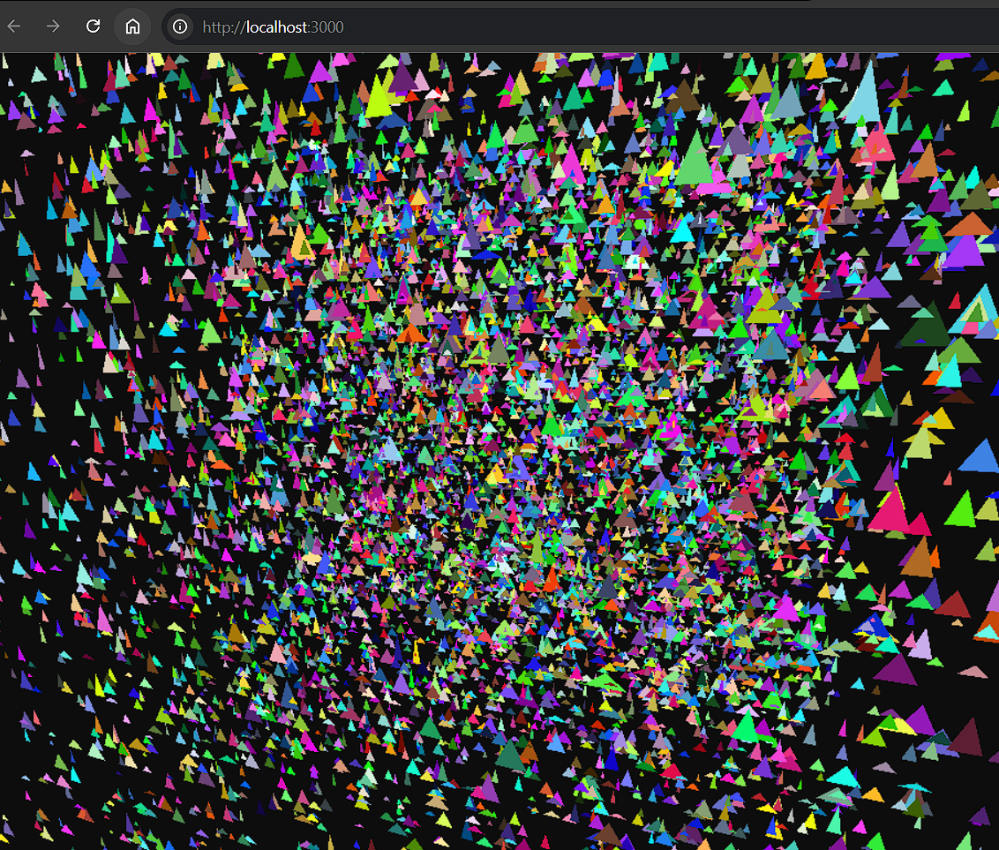

# NullGraph

**Zero scene graph. Zero copy. Infinite scale.**
> A Data-Oriented WebGPU rendering framework for massive web worlds.

NullGraph is a brutalist, high-performance rendering library designed specifically for **Web Workers** and **Data-Oriented Design (DOD)**.

It completely abandons the traditional Object-Oriented *Scene Graph* (`Root -> Node -> Mesh -> Geometry`) in favor of mapping raw, contiguous `ArrayBuffers` directly to **WebGPU Storage Buffers**.

If you are building an MMO, a voxel engine, or a multiverse with tens of thousands of dynamic entities, NullGraph ensures your main thread stays at a flat **0ms overhead**.

---

## Why NullGraph?

Traditional WebGL frameworks (like Three.js or Babylon.js) are built for ease of use, heavily relying on:
- `new` keyword allocations
- Dynamic memory
- Garbage Collection (GC)

When building massive, chunk-streaming open worlds, this OOP overhead causes:
- Main-thread stuttering
- Shader compilation lag

### NullGraph solves this by doing less:

- **Zero Scene Graph**  
  No `.traverse()`, no `.updateMatrixWorld()`. The GPU reads your flat array.

- **Zero-Copy Streaming**  
  Calculate your ECS layout in a Web Worker, pass the `ArrayBuffer` to the main thread, and upload directly to VRAM.

- **No GC Spikes**  
  Memory is pre-allocated. No runtime object creation or destruction.

- **Predictable WebGPU Pipelines**  
  No mid-game shader compilation stutters.

---

## Installation

> ⚠️ Currently in pre-release development

```bash
npm install null-graph gl-matrix
```
# NullGraph Architecture

NullGraph assumes you are running a tight ECS where entity data is packed into a flat `Float32Array` (or passed directly from a Rust/C++ WebAssembly module).

You define the **Stride** (how many floats per entity) and the **Offsets** (where position, scale, and color live). The WebGPU WGSL shader reads this storage buffer directly to instance your geometry.

---

## Quick Start

### TypeScript

```ts
import { NullGraph, Camera } from 'null-graph';

async function init() {
    const canvas = document.getElementById('gpuCanvas') as HTMLCanvasElement;

    // 1. Initialize the WebGPU Device
    const engine = new NullGraph();
    await engine.init(canvas);

    // 2. Setup Camera (Powered by gl-matrix)
    const camera = new Camera(75, canvas.width / canvas.height, 0.1, 1000.0);
    camera.updateView([0, 20, 80], [0, 0, 0]);
    engine.updateCamera(camera);

    // 3. Generate or Receive DOD ArrayBuffer (e.g., from a Web Worker)
    const entityCount = 10000;
    const strideFloats = 14; 
    const ecsBuffer = new Float32Array(entityCount * strideFloats);

    // Example: Populate buffer (In production, this comes from your ECS Worker)
    for (let i = 0; i < entityCount; i++) {
        const base = i * strideFloats;
        ecsBuffer[base + 1] = (Math.random() - 0.5) * 100; // X
        ecsBuffer[base + 2] = (Math.random() - 0.5) * 100; // Y
        ecsBuffer[base + 3] = (Math.random() - 0.5) * 100; // Z
        
        ecsBuffer[base + 8] = 1.0; // Scale X
        ecsBuffer[base + 9] = 1.0; // Scale Y
        ecsBuffer[base + 10] = 1.0; // Scale Z
    }

    // 4. Blast directly to VRAM
    engine.updateEntities(ecsBuffer, entityCount);

    // 5. Render Loop (Zero CPU overhead)
    function frame() {
        engine.render();
        requestAnimationFrame(frame);
    }

    frame();
}

init();
```
## Roadmap

NullGraph is currently in active development for the Axion Engine. Upcoming features include:

- [ ] Depth / Z-Buffer Integration (Proper 3D occlusion)
- [ ] Custom WGSL Material Injection (Passing Material IDs via the ECS buffer)
- [ ] Raw GLTF Buffer Parsing (Extracting static vertex arrays from models)
- [ ] Directional Shadows

---

## License

NullGraph is released under the MIT License.